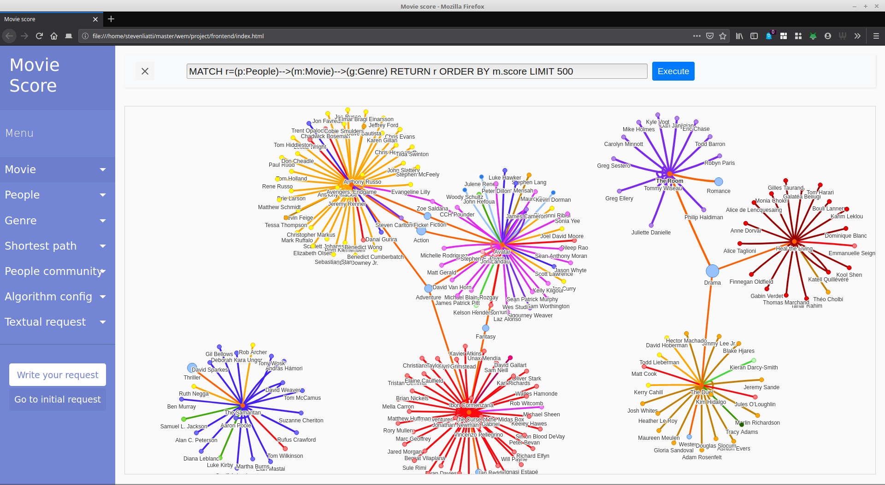
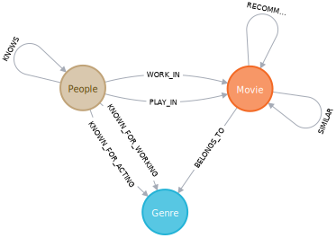
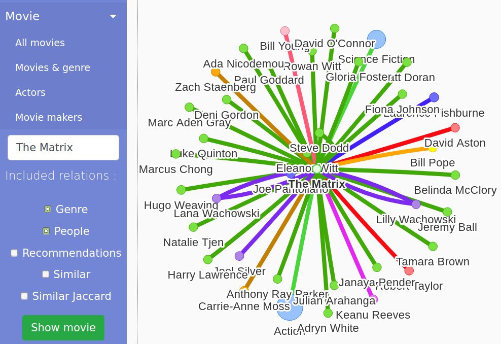
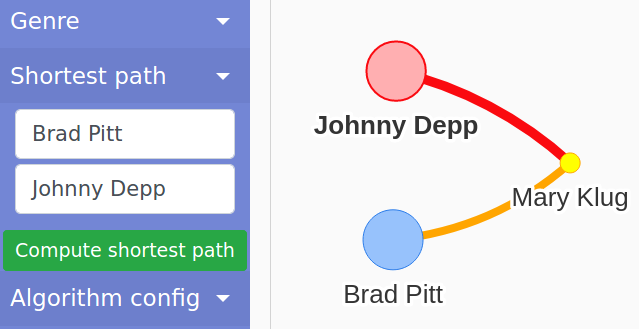
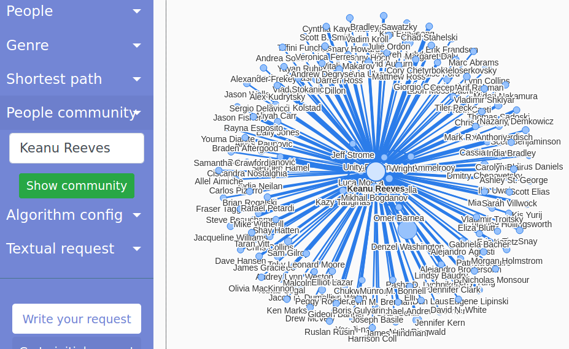
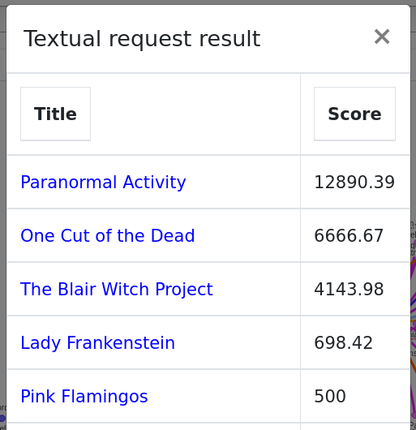

# Buts
Les objectifs de ce projet sont de déterminer les scores de films selon leur ratio, calculé ainsi `ratio = revenu / budget`, de déterminer l'influence qu'ils ont sur les "*peoples*" (acteurs et membres de l'équipe de réalisation) qui ont participé aux-dits films et montrer les genres de films les plus populaires.

# Contexte et objectifs
Ce projet se déroule dans le cadre du cours de Web Mining du master MSE HES-SO. L'objectif principal du projet est de visualiser, sous forme graphe, les relations entre les films, leurs genres et les *peoples*. Nous appliquons des algorithmes choisis pour déterminer les noeuds du graphe les plus importants, trouver les plus courts chemins entre *peoples* et former des communautés de films, *peoples* ou genres.

# Données

## TMDb

Nous utilisons les données provenant de [The Movie Database (TMDb)](https://www.themoviedb.org/) à l'aide de son [API](https://developers.themoviedb.org/3/getting-started). À partir des données d'un film, nous avons tous les éléments nécessaires pour déterminer son score et ses relations aux *peoples* et genres associés. Ci-dessous un exemple de données retournées par l'API pour le film *Pirates of the Caribbean: The Curse of the Black Pearl* :

```json
{
    "budget": 140000000,
    "revenue": 655011224,
    "genres": [
        { "id": 12, "name": "Adventure" },...
    ],
    "id": 22,
    "title": "Pirates of the Caribbean: The Curse of the Black Pearl",
    "original_language": "en",
    "overview": "Jack Sparrow, a freewheeling ...",
    "release_date": "2003-07-09",
    "runtime": 143,
    "spoken_languages": [
        { "iso_639_1": "en", "name": "English"}
    ],
    "status": "Released",
    "popularity": 54.847,
    "vote_average": 7.7,
    "vote_count": 14020,
    "credits": {
        "cast": [
            {
                "cast_id": 12,
                "character": "Captain Jack Sparrow",
                "id": 85,
                "name": "Johnny Depp",
                "order": 0
            },
            {
                "cast_id": 5,
                "character": "Captain Hector Barbossa",
                "id": 118,
                "name": "Geoffrey Rush",
                "order": 1
            },...
        ],
        "crew": [
            {
                "department": "Directing",
                "id": 1704,
                "job": "Director",
                "name": "Gore Verbinski"
            },...
        ]
    },
    "keywords": {
        "keywords": [
            { "id": 911, "name": "exotic island" },
            { "id": 1318, "name": "blacksmith" },
            { "id": 1321, "name": "gold" },...
        ]
    },
    "similar": {
        "results": [
            {
                "id": 58,
                "title": "Pirates of the Caribbean: Dead Man's Chest",
                "release_date": "2006-06-20",
                "original_language": "en",
                "genre_ids": [ 28, 12, 14 ],
                "overview": "Captain Jack Sparrow works ...",
                "popularity": 31.344,
                "vote_count": 10605,
                "vote_average": 7.2
            },...
        ]
    }
}
```

Nous pouvons voir que nous avons les informations relatives au budget et revenu généré par le film, ainsi que la liste des acteurs, triée par ordre d'importance de leur rôle dans le film et la liste des membres de l'équipe de réalisation, avec pour chacun la fonction endossée pour ce film. Nous avons également la liste des genres auxquels le film appartient, une liste de mots-clés concernant ce film et une liste de films similaires (basée sur les genres et mots-clés). Cette information peut être récupérée sur une URL de ce genre :

```bash
https://api.themoviedb.org/3/movie/$id?api_key=$key&language=en-US&append_to_response=credits%2Ckeywords%2Csimilar
```

La première étape est d'obtenir tous les films disponibles sur TMDb. Pour cela, l'API offre un export journalier de quelques informations basiques concernant les films, à savoir son id dans TMDb, son titre original, la popularité au sein du site et des indications si présence de vidéos et/ou contenu adulte, un exemple est visible ci-dessous. Le seul champs qui nous intéresse est l'id, qui nous permet de récuperer plus d'informations sur les films telles que présentées ci-dessus.

```json
{
    "adult": false,
    "id": 20,
    "original_title": "My Life Without Me",
    "popularity": 9.134,
    "video": false
}
{
    "adult": false,
    "id": 24,
    "original_title": "Kill Bill: Vol. 1",
    "popularity": 24.601,
    "video": false
}
{
    "adult": false,
    "id": 25,
    "original_title": "Jarhead",
    "popularity": 14.574,
    "video": false
}
```

Nous devons donc parcourir ce fichier, comportant plus de 500'000 films et récupérer les informations au format JSON.

## Base de données orientée graphe avec Neo4j

Après avoir récupéré et épuré les données brutes de TMDb, nous les stockons dans [Neo4j](https://neo4j.com/). La structure de graphe est particulièrement intéressante pour décrire les relations entre différentes entités, pour trouver des communautés autour de certains noeuds et pour avoir un joli rendu visuel. L'image suivante décrit ces noeuds et relations :



### Noeuds

Nous avons 3 types de noeuds (dont 2 sous-types) :

- `Movie` : représente un film, avec les attributs suivants :
    - `id` : identifiant provenant de TMDb
    - `title`
    - `budget`
    - `revenue`
    - `score` : rapport `revenue / budget`
- `Genre` : représente un genre de films, comme Action, Comédie, etc. avec les attributs suivants :
    - `id` : identifiant provenant de TMDb
    - `name`
- `People` : peut également avoir l'étiquette `Actor` et `MovieMaker`, il représente les acteurs et/ou personnes ayant participé au film et a les attributs suivants :
    - `id` : identifiant provenant de TMDb
    - `name`
    - `gender`
    - `score` : redistribution d'une fraction des scores des films dans lequel ce `People` apparait divisé par ce même nombre de films

Nous avons appliqué ces contraintes sur les trois types de noeuds, qui rendent l'id de TMDb unique et créent également un index sur cet id :
```SQL
CREATE CONSTRAINT ON (m:Movie) ASSERT m.id IS UNIQUE;
CREATE CONSTRAINT ON (g:Genre) ASSERT g.id IS UNIQUE;
CREATE CONSTRAINT ON (p:People) ASSERT p.id IS UNIQUE;
```

### Relations

Nous avons 8 types de relations principales :

- `BELONGS_TO` : indique l'appartenance d'un `Movie` à un `Genre`
- `PLAY_IN` : relie un `People/Actor` à un `Movie` avec comme attribut `character` indiquant le personnage interprété dans ce film
- `WORK_IN` : relie un `People/MovieMaker` à un `Movie` avec comme attribut `job` indiquant quel poste il a dans ce film
- `KNOWN_FOR_ACTING` : indique l'appartenance d'un `People/Actor` à un `Genre` avec un attribut `count` dénombrant le nombre de fois où ce `People` apparait dans un film de ce `Genre`
- `KNOWN_FOR_WORKING` : indique l'appartenance d'un `People/MovieMaker` à un `Genre` avec un attribut `count` dénombrant le nombre de fois où ce `People` apparait dans un film de ce `Genre`
- `KNOWS` : indique si deux `People` se connaissent (*id est* se sont croisés dans un même film) avec un attribut `count` dénombrant le nombre de fois où ces deux `People` se sont croisés
- `SIMILAR` : relie chaque `Movie` à la liste de ses films semblables selon les critères TMDb
- `RECOMMENDATIONS` : relie chaque `Movie` à la liste de ses films recommandés selon les utilisateurs de TMDb

Nous avons calculé (voir section suivante) 3 relations supplémentaires, avec [l'algorithme de Jaccard](https://fr.wikipedia.org/wiki/Indice_et_distance_de_Jaccard) sur les similarités entre noeuds :

- `SIMILAR_MOVIES_ALGO` : relie chaque `Movie` à la liste de ses films semblables selon la similarité des genres en commun calculée avec Neo4j avec un attribut `score`
- `SIMILAR_FOR_ACTING` : relie chaque `People/Actor` à la liste des acteurs semblables selon la similarité des genres en commun calculée avec Neo4j avec un attribut `score`
- `SIMILAR_FOR_WORKING` : relie chaque `People/MovieMaker` à la liste des *movie makers* semblables selon la similarité des genres en commun calculée avec Neo4j avec un attribut `score`

## Application d'algorithmes sur le graphe

Neo4j inclu par défaut [plusieurs algorithmes](https://neo4j.com/docs/graph-data-science/1.1/algorithms/) de graphe, à appliquer sur les noeuds et/ou arcs du graphe. Nous en avons appliqués quelques uns sur nos données. Certains algorithmes, comme Page Rank, nécessitent la création d'un sous-graphe contenant les noeuds et les relations impliqués dans l'algorithme.

### Algorithmes de centralité

#### Page Rank

Nous avons appliqué [Page Rank](https://neo4j.com/docs/graph-data-science/1.1/algorithms/page-rank/) sur les films avec comme lien la relation `SIMILAR` et avons stocké ce score dans une nouvelle propriété `pagerankSimilar` dans chaque noeud `Movie` :

```
// Création du sous-graphe
CALL gds.graph.create(
    'pagerank-movie-similar',
    'Movie',
    'SIMILAR'
);

// Exécution de Page Rank sur les films similaires
CALL gds.pageRank.write('pagerank-movie-similar', {
  maxIterations: 20,
  dampingFactor: 0.85,
  writeProperty: 'pagerankSimilar'
}) YIELD nodePropertiesWritten AS writtenProperties, ranIterations;
```

Nous avons répété l'opération mais cette fois sur la relation `RECOMMENDATIONS`, pour obtenir un autre score `pagerankRecommendations` :

```
// Création du sous-graphe
CALL gds.graph.create(
    'pagerank-movie-recommendations',
    'Movie',
    'RECOMMENDATIONS'
);

// Exécution de Page Rank sur les films recommendés
CALL gds.pageRank.write('pagerank-movie-recommendations', {
  maxIterations: 20,
  dampingFactor: 0.85,
  writeProperty: 'pagerankRecommendations'
}) YIELD nodePropertiesWritten AS writtenProperties, ranIterations;
```

#### Degré de centralité

Pour les *peoples* nous nous sommes servis du [Degree Centrality](https://neo4j.com/docs/graph-data-science/1.1/algorithms/degree-centrality/) algorithme, qui pour rappel compte le nombre d'arcs ou arêtes entrants et sortants d'un noeud, pour ajouter un nouvel attribut, le score `knowsDegree` aux noeuds `People` selon la relation récursive `KNOWS`.

```
// calcul le Degree Centrality pour les People avec KNOWS
CALL gds.alpha.degree.write({
  nodeProjection: 'People',
  relationshipProjection: {
    KNOWS: {
      type: 'KNOWS',
      projection: 'REVERSE'
    }
  },
  writeProperty: 'knowsDegree'
});
```

Pour les genres, nous avons procédé au calcul de ce degré à la main, en comptant le nombre d'arc entrants (par type de relation) dans les noeuds `Genre`, car l'exécution du précédent algorithme ne fonctionnait pas dans cette situation. Nous obtenons ainsi cinq nouveaux attributs de score pour les genres :

```
// ajout de propriétés de taille aux Genre
MATCH (g:Genre)
SET g.belongsToDegree = size((g)<-[:BELONGS_TO]-())
SET g.knownForActingDegree = size((g)<-[:KNOWN_FOR_ACTING]-())
SET g.knownForWorkingDegree = size((g)<-[:KNOWN_FOR_WORKING]-())
SET g.knownForDegree = size((g)<-[:KNOWN_FOR_WORKING|:KNOWN_FOR_ACTING]-())
SET g.degree = size((g)<-[:BELONGS_TO|:KNOWN_FOR_WORKING|:KNOWN_FOR_ACTING]-());
```

### Algorithmes de communautés

Nous nous sommes servis de l'algorithme de [Louvain](https://neo4j.com/docs/graph-data-science/1.1/algorithms/louvain/) pour regrouper les *peoples* par communautés selon le `count` de la relation `KNOWS` qu'ils ont entre eux.

```
// Création du sous-graphe
CALL gds.graph.create(
    'people-knows-community-louvain-graph',
    'People',
    {
        KNOWS: {
            orientation: 'UNDIRECTED'
        }
    },
    {
        relationshipProperties: 'count'
    }
);

// Exécution de Louvain sur les peoples
CALL gds.louvain.write(
    'people-knows-community-louvain-graph',
    { writeProperty: 'knowsCommunity' }
)
YIELD communityCount, modularity, modularities;
```

### Algorithmes de similarité entre noeuds

Nous avons également appliqué l'algorithme [Node Similarity](https://neo4j.com/docs/graph-data-science/1.1/algorithms/node-similarity/) sur les films et les *peoples* selon les genres vers lesquels ils pointent. Pour les films, la nouvelle relation `SIMILAR_MOVIES_ALGO` est proche de `SIMILAR` déjà existante et fournie par TMDb, mais il peut être intéressant de voir les différences. Les *peoples* gagnent quant à eux les relations vers les genres nommés `SIMILAR_FOR_ACTING` et `SIMILAR_FOR_WORKING` selon leur ressemblance en fonction des genres dans lesquels ils ont joué / travaillé.

```
// Création du sous-graphe
CALL gds.graph.create(
    'movie-belongs-to-node-similar',
    ['Movie', 'Genre'],
    'BELONGS_TO'
);
// Exécution de la similarité sur les films (BELONGS_TO)
CALL gds.nodeSimilarity.write('movie-belongs-to-node-similar', {
    writeRelationshipType: 'SIMILAR_MOVIES_ALGO',
    writeProperty: 'score'
}) YIELD nodesCompared, relationshipsWritten;

// Création du sous-graphe
CALL gds.graph.create(
    'people-known-for-acting-node-similar',
    ['People', 'Genre'],
    'KNOWN_FOR_ACTING'
);
// Exécution de la similarité sur les peoples (KNOWN_FOR_ACTING)
CALL gds.nodeSimilarity.write('people-known-for-acting-node-similar', {
    writeRelationshipType: 'SIMILAR_FOR_ACTING',
    writeProperty: 'score'
}) YIELD nodesCompared, relationshipsWritten;

// Création du sous-graphe
CALL gds.graph.create(
    'people-known-for-working-node-similar',
    ['People', 'Genre'],
    'KNOWN_FOR_WORKING'
);
// Exécution de la similarité sur les peoples (KNOWN_FOR_WORKING)
CALL gds.nodeSimilarity.write('people-known-for-working-node-similar', {
    writeRelationshipType: 'SIMILAR_FOR_WORKING',
    writeProperty: 'score'
}) YIELD nodesCompared, relationshipsWritten;
```

### Algorithmes de plus court chemin

Nous nous sommes servis de l'algorithme [Shortest Path](https://neo4j.com/docs/cypher-manual/current/execution-plans/shortestpath-planning/) inclu dans Cypher, directement dans l'interface (voir section Frontend), pour visualiser le plus court chemin entre deux *peoples* via leur relation `KNOWS`.

```
MATCH (p1:People {name: 'Brad Pitt'}), (p2:People {name: 'Johnny Depp'}),
p = shortestPath((p1)-[r:KNOWS *]-(p2))
RETURN p
```

# Architecture


Tout d'abord, un programme est dédié à la récupération de données proprement dites (`Crawler`), à partir de l'API fournissant les données en JSON, enregistrant les données pour les films ayant les champs revenu et budget valides. Ensuite, ces données seront manipulées et insérées dans la base de donnée choisie de manière cohérente et selon les besoins de l'interface (`Parser`). Finalement, une interface graphique sera implémentée pour visualiser les graphes obtenus et exécuter des requêtes à la base de données (`Frontend`).

## Uses cases
Voici la liste des principaux *uses cases* du système :

- Visualiser l'interconnexion (via un graphe) entre les différentes entités représentées dans la base de données (films, acteurs, genres)
- Modifier l'affichage de ce graphe en spécifiant certains critères de recherche
- Visualiser (à l'aide du graphe) l'importance des films en fonction de leurs score (revenu/budget)
- Lister les différents films répertoriés dans notre base
- Rechercher films, *peoples* ou genres
- Visualiser les communautés d'acteurs, de genre ou de films qui ont des critères communs
- Visualiser le plus court chemin entre deux *peoples*

# Analyse technologique préliminaire

Les langages et technologies envisagés sont Scala et/ou Rust pour la partie développement, pour la justesse, l'efficacité et/ou la performance, et [OrientDB](https://orientdb.com/), [ArangoDB](https://www.arangodb.com/) ou [Neo4j](https://neo4j.com/) pour la base de données, avec leur propres langages de requêtes. Différents outils pour le frontend / visualisation sont également comparés.


## Bases de données

Nous pensons que le modèle de base de données orienté graphe est adapté à notre cas de figure, les différentes entités peuvent être représentées comme des noeuds d'un graphe et les liens les composants peuvent être vus comme des arcs ou arêtes du graphe.

### OrientDB
OrientDB est une base de données écrite en Java, multi paradigme, stockant ses données sous forme de documents, pair clé-valeur ou graphe. Elle met en avant sa scalabilité horizontale, avec la possibilité de déployer une base OrientDB sur plusieurs machines. Elle utilise un langage de requête optimisé pour les requêtes dans un graphe, nommé Gremlin.

### ArangoDB
ArangoDB offre à peu près les mêmes fonctionnalités qu'OrientDB, c'est une base de données écrite en C++, multi paradigme, stockant ses données sous forme de documents, pair clé-valeur ou graphe. Elle met en avant des fonctionnalités comme un support pour données géographiques (GeoJSON) ou ArangoML, pipeline pour machine learning. Elle utilise un langage de requête optimisé pour les requêtes dans un graphe, nommé AQL.

### Neo4j
Noeo4j est une base de données écrite en Java/Scala stockant ses données sous forme de graphe, avec le contenu des données comme noeud ou sommet du graphe et les relations entre ces données comme arête ou arc du graphe. Elle utilise un langage de requête optimisé pour les requêtes dans un graphe, nommé Cypher.

### Bilan des bases de données
Après avoir comparé ces trois technologies, nous pensons utiliser Neo4j. Bien qu'elle soit moins scalable que les deux autres et apparemment moins performante sur des énormes jeux de données, elle offre nativement d'une part de nombreuses requêtes implémentant des algorithmes de centralité des noeuds de graphes, comme PageRank, ArticleRank ou de plus court chemin et d'autre part des méthodes de visualisation plus faciles à prendre en main. Étant donné le volume de données que nous allons traiter (sur les 500'000 films recensés sur TMDb, nous pensons qu'au moins quelques milliers ou dizaines de milliers ont les informations qui nous intéressent), les défauts apparents de Neo4j sont comblés par ces deux *killer features* qui comblent nos besoins.

## Frontend

Nous envisageons de réaliser l'interface sous forme de page web montrant le graphe des films, *peoples* et genres et avec des contrôles permettant d'exécuter des requêtes. Nous avons trouvé différentes librairies Javascript qui facilitent le dessin de graphes dans le navigateur, telles que [D3.js](https://d3js.org/), [Vis.js](http://visjs.org/), [Sigma.js](http://sigmajs.org/) ou encore [Cytoscape.js](http://js.cytoscape.org/). Toutes proposent une API ou les noeuds et arêtes du graphe peuvent être personnalisés, cela va du choix des couleurs à la taille des noeuds ou arêtes en passant par la position ou manipulation à la souris (zoom, déplacement, etc.). Dans le même sens de simplicité et de facilité d'intégration avec Neo4j, nos choix se portent sur deux autres librairies : [neovis.js](https://github.com/neo4j-contrib/neovis.js) ou [NeoSig](https://github.com/sim51/neosig). Ce sont deux wrappers se basant respectivement sur Vis.js et Sigma.js mais qui facilitent l'intégration avec des données provenant directement de Neo4j.


# Implémentation

## Features
Voici la liste des différentes fonctionnalités que nous avons réalisé dans le cadre de ce projet :

- Backend :

    - Récupération des données sur les films mises à disposition par TMDb
    - Traitement de ces données pour sélectionner uniquement ce dont nous avons besoin
    - Calcul d'un score pour les différents films
    - Insertion des données dans une base de données orientée graphe
    - Création des relations entre les entités
    - Application d'algorithmes sur les données insérées

- Frontend :

    - Visualisation des données sous forme d'interface graphique représentant un graphe
    - Regroupement des données en fonction de certains critères (genre, film etc.)
    - Regroupement des acteurs en fonction des genres des films dans lesquels ils ont joué
    - Création de communautés
    - Recherche spécifique (film, acteur etc.)
    - Présentation des films en fonction de leurs scores respectifs

## Collecteur de données

Nous avions plusieurs stratégies disponibles pour réaliser notre collecteur de données. La première était de réutiliser notre laboratoire n°1 sur Solr, nous avions déjà crawlé le site TMDb directement. Mais les données qu'il récoltait n'était pas autant complètes que ce que l'API pouvait fournir, il aurait donc fallu l'améliorer. Nous n'étions également pas sûrs de pouvoir exporter les données brutes au format JSON par exemple pour ensuite pouvoir les insérer dans la base de données choisie. Finalement, nous n'étions pas certains de pouvoir correctement le paralléliser pour obtenir rapidement toutes les données (voir la suite). Nous voulions donc interroger l'API TMDb directement.

### Approche naïve avec bash

Pour rappel, comme décrit dans la section données, nous disposons d'un fichier d'environ 500'000 lignes, contenant tous les IDs des films disponibles, comme l'illustre un extrait ci-dessous :

```json
{"id":3924,"original_title":"Blondie","popularity":2.569,"video":false}
{"id":2,"original_title":"Ariel","popularity":12.697,"video":false}
{"id":5,"original_title":"Four Rooms","popularity":13.013,"video":false}
```

Pour rapidement tester l'automatisation de la récupération de toutes les données des films, nous avons concocté le script bash suivant, qui lit ce fichier d'IDs, pour chaque id effectue une requête HTTP à l'API TMDb avec `curl`, puis écrit chaque réponse dans le même fichier, un film/réponse par ligne :

```bash
#!/usr/bin/env bash

$api_key="..."

for id in $(cat movie_ids.json | jq '.id'); do
    curl -s "https://api.themoviedb.org/3/movie/$id
        ?api_key=$api_key&language=en-US&append_to_response
        =credits%2Ckeywords%2Csimilar" >> movies.json
        echo "" >> movies.json
done
```

Constatant que ce script ne prenait pas en compte les requêtes avec erreur et surtout qu'il récupérait que quelques films par seconde (entre 2 et 3), il nous aurait fallu entre 2 et 3 semaines pour faire les 500'000 requêtes. Ce qui est beaucoup trop long.

### Approche robuste et efficace : programme Rust "distribué"

Jusqu'à fin 2019, l'API TMDb avait une limite d'utilisation à 40 requêtes sur 10 secondes, ou 4 requêtes par seconde. Mais depuis le début de l'année, il n'y a plus de limite. Nous pouvons donc "bombarder" l'API pour récupérer les données aussi vite que désiré. Pour ce faire, nous avons réalisé un `crawler` multi threads en Rust. Le choix de Rust a été fait pour ses performances, la justesse du code obtenu et pour pratiquer le langage également. Nous nous sommes servis de différents *crates* Rust, comme [reqwest](https://crates.io/crates/reqwest) pour les requêtes HTTP, [serde](https://crates.io/crates/serde) et [serde_json](https://crates.io/crates/serde_json) pour la (dé)sérialisation du JSON et de la librairie standard Rust pour la gestion de la concurrence (via les [channels](https://doc.rust-lang.org/rust-by-example/std_misc/channels.html)). Chaque film récupéré est désérialisé et les conditions suivantes sont testées :

- champs "budget" et "revenu" supérieurs à 1000 (dollars, seuil défini arbitrairement)
- liste de genres non vide
- liste des *peoples* non vide
- liste des films similaires non vide
- liste des films recommandés non vide

Si ces conditions sont remplies, le film est gardé pour être écrit dans un fichier. Nous avions donc une version améliorée du script bash, plus rapide, robuste et multi core.

Pour accélérer davantage la récupération, nous avions à disposition via `ssh` quelques 70 machines de bureau (Intel 4 cores / 8 threads, 32 Go de RAM, SSD) reliées à internet par des interfaces de 100 Mb/s ou 1 Gb/s. A l'aide d'un deuxième petit programme Rust, le `splitter`, et de divers commandes Linux comme `parallel-ssh`, nous avons pu séparer le fichier d'IDs des films en autant de parts égales que de machines disponibles. Chaque machine a lancé le crawler sur 20 threads avec un fichier d'IDs réduit, différent pour chaque machine. Nous avions donc environ l'équivalent de 70 * 20 = 1400 scripts bash initiaux qui récupéraient les informations voulues sur les 500'000 films de TMDb. En quelques minutes, les crawlers terminaient leur job. Avec un dernier script `map_reduce.sh` et de [`cloudsend.sh`](https://github.com/tavinus/cloudsend.sh), nous avons pu récupérer tous les fichiers produits contenant les informations complètes d'un film, un film par ligne, sur un compte nextcloud en notre possession.

Pour reproduire cette récupération, vous devez disposer de machines GNU/Linux connectées à internet, que vous pouvez contrôler par `ssh`, dont le répertoire `home` est synchronisé sur chacune et remplir le fichier `collector/.env` d'une manière analogue à la suivante :

```conf
IPS=ips.txt ; La liste des IPs des machines, une par ligne
REMOTE_USER=user ; Utilisateur SSH
REMOTE_HOST=192.168.1.2 ; IP de la machine distante principale, pour init
REMOTE_WORKING_DIR=working_dir ; Le répertoire de travail courant
TMDB_API_KEY=1a2b3c4d5e6f7g8h9i0j ; Une clé API pour TMDb
THREADS=20 ; Le nombre de threads par machine
NEXTCLOUD_UPLOAD=https://your.nextcloud.com/qwertz ; Le répertoire Nextcloud
```

Un `makefile` est disponible dans `collector` pour exécuter chaque étape de la récupération.


## Instance Neo4j

Nous nous sommes servis de [l'image Docker officielle de Neo4j](https://hub.docker.com/_/neo4j) en version 3.5 comme instance de base de données. Un makefile à la racine permet de lancer un container Docker avec ou sans volume pour la sauvegarde des données insérées dans Neo4j. Pour lancer cette instance, il faut au préalable remplir un fichier `.env` de manière analogue à la suivante :

```conf
NEO4J_AUTH=neo4j/wem2020 ; Authentification Neo4j
; D'après nos essais, 20G de mémoire sont largement suffisants
NEO4J_dbms_memory_pagecache_size=20G
NEO4J_dbms_memory_heap_max__size=20G
; Plugin pour les algorithmes
NEO4J_dbms_security_procedures_unrestricted=gds.*
```

## Parsing et insertion dans Neo4j

Nous avons réalisé un programme lisant les données brutes en JSON provenant de la collecte de TMDb et qui les insèrent selon nos besoins dans Neo4j. Nous avons choisi Scala comme langage, en raison de ses performances, de la justesse du langage et aussi pour bénéficier de la librairie [spray-json](https://github.com/spray/spray-json) pour la désérialisation du JSON et de [neotypes](https://neotypes.github.io/neotypes/), le driver Neo4j Scala basé sur le driver officiel Java. Le programme est constitué de six grandes étapes :

1. Création des contraintes sur les types de noeuds
1. Désérialisation des films en JSON en `case class`es Scala et filtrage sur les jobs des `MovieMaker` et sur le nombre d'acteurs par film
1. Création de `Map` et `Set` Scala à partir des `Movie`s pour pré-traiter les relations entre les différents noeuds (insertion parallèle de certaines données)
1. Ajout de tous les noeuds dans Neo4j, sans relations
1. Ajout des relations entre les noeuds concernés à partir des collections créées en 3.
1. Les algorithmes choisis sont exécutés sur l'ensemble des données insérées.

Les insertions de noeuds et des relations se font avec le langage de requêtes de Neo4j, [Cypher](https://neo4j.com/developer/cypher-query-language/). À titre d'exemple, ci-dessous se trouvent deux méthodes Scala pour l'insertion d'un film et pour l'insertion d'une relation de similarité entre deux films :

```scala
def addMovie(movie: Movie) = driver.readSession { session =>
  val score: Double = computeMovieScore(movie)
  c"""CREATE (movie: Movie {
      id: ${movie.id},
      title: ${movie.title},
      budget:${movie.budget},
      revenue:${movie.revenue},
      score: $score
   })""".query[Unit].execute(session)
}

def addSimilarRelation(movie: Movie, movieId: MovieId) =
driver.readSession { session =>
  c"""MATCH (m1: Movie {id: ${movie.id}})
      MATCH (m2: Movie {id: ${movieId.id}})
      MERGE (m1)-[r:SIMILAR]-(m2)
    """.query[Unit].execute(session)
}
```

Pour reproduire l'opération, il faut créer le répertoire `parser/data`, contenant le fichier `movies.json` récupéré grâce au Collecteur et remplir le fichier `parser/.env` d'une manière analogue à la suivante :

```conf
NEO4J_HOST=bolt://localhost:7687
NEO4J_USER=neo4j
NEO4J_PASSWORD=wem2020
JVM_RAM=8g
```

## Frontend

Nous avons réalisé un frontend web à l'aide de [neovis.js](https://github.com/neo4j-contrib/neovis.js), du [driver Neo4j javascript](https://github.com/neo4j/neo4j-javascript-driver) et de [Bootstrap](https://getbootstrap.com/) pour l'autocomplétion et le design CSS. Notre interface permet d'exécuter des requêtes Cypher directement dans la barre de requêtes ou via des boutons avec requêtes pré-enregistrées et de visualiser les résultats sous forme de graphe, avec des noeuds et arcs de taille et couleurs différentes symbolisant le score des noeuds, les types de noeuds différents, les communautés de *peoples* ou encore la force des liens entre différents noeuds.

Pour lancer le frontend correctement, il faut créer et remplir le fichier `frontend/.env` d'une manière analogue à la suivante :

```conf
URL_DB=bolt://localhost:7687
USER=neo4j
PWD=wem2020
```

Puis exécuter `make` dans `frontend`.

La requête initiale récupère un échantillon de 500 noeuds de genres, films et *peoples* associés, ordonnés par le score des films :
```js
const INITIAL_QUERY =
    "MATCH r=(p:People)-->(m:Movie)-->(g:Genre) \
    RETURN r ORDER BY m.score LIMIT 500";
```

La configuration initiale de neovis.js est la suivante :

```js
var config = {
    container_id: "viz",
    server_url: URL_DB,
    server_user: USER,
    server_password: PWD,
    labels: {
        "Movie": {
            "caption": "title",
            "size": sizeMovie,
        },
        "People": {
            "caption": "name",
            "size": sizePeople,
            "community": "knowsCommunity"
        },
        "Actor": {
            "caption": "name"
        },
        "MovieMaker": {
            "caption": "name"
        },
        "Genre": {
            "caption": "name",
            "size": sizeGenre
        }
    },
    relationships: {
        "BELONGS_TO": {
            "caption": false
        },
        "KNOWN_FOR_ACTING": {
            "caption": false,
            "thickness": "count"
        },
        "KNOWN_FOR_WORKING": {
            "caption": false,
            "thickness": "count"
        },
        "KNOWS": {
            "caption": false,
            "thickness": "count"
        },
        "PLAY_IN": {
            "caption": false
        },
        "WORK_IN": {
            "caption": false
        },
        "RECOMMENDATIONS": {
            "caption": false
        },
        "SIMILAR": {
            "caption": false
        },
        "SIMILAR_MOVIES_ALGO": {
            "caption": false,
            "thickness": "score"
        },
        "SIMILAR_FOR_ACTING": {
            "caption": false,
            "thickness": "score"
        },
        "SIMILAR_FOR_WORKING": {
            "caption": false,
            "thickness": "score"
        }
    },
    initial_cypher: INITIAL_QUERY
};
```

Tous les noeuds et relations sont décrits et la plupart des tailles de noeuds et épaisseurs d'arcs sont configurées pour correspondre à des attributs de noeuds ou de relations comme le score ou le compteur de relations.

Trois sections différentes, une pour les films, une pour les genres et une pour les *peoples* sont disponibles pour exécuter des requêtes sur ces types de noeuds propres ainsi que trois champs input où l'utilisateur peut entrer le nom d'un film, genre ou *people* et obtenir les relations et noeuds associés au nom entré. Des cases à cocher invitent à activer ou désactiver l'affichage de certaines relations. L'autocomplétion est active sur les champs input.



Il est possible d'exécuter le plus court chemin entre deux *peoples* en fonction de leur relation `KNOWS`. La taille des noeuds peut être ajustée selon différents critères calculés avec les algorithmes.



Un input permet de visualiser la communauté d'un *people*.



Certaines requêtes peuvent également être visualisées sous forme de tableau, comme la liste des meilleurs films selon leur score, car elles sont naturellement présentables sous forme de tableau.




## Tests et validation du projet
Nous avons effectué des tests unitaires au niveau des méthodes critiques et complexes, notament celles visant à interroger la base de données.
Pour la partie frontend, nous avons effectué une sorte d'audit, en faisant tester l'app à un utilisateur externe au projet, afin d'avoir un retour sur l'expérience utilisateur de l'interface graphique proposée.
Voici la liste avec les principales fonctionnalités de notre application. Elles ont été testées une à une, et, pour chaque fonctionnalité testée, une colonne correspondante est renseignée si cette fonctionnalité a été validée ou non avec la possibilité de laisser un commentaire (3ème colonne).

Voir exemple ci-dessous :

| Feature    | Validation(OK/KO) | Comment           |
| ---------  | ----------------- | ----------------- |
| Navigation | OK                | On comprend facilement comment passer d'une section à une autre |
| Recherche par nom  | OK                | Autocomplétion OK |
| Zoom       | OK                | Smooth et rapide    |

# Planning envisagé


| Étape                  | Délivrables / Workpackage                                                 |
|------------------------|---------------------------------------------------------------------------|
| Crawling des données   | Programme récupérant les données de TMDb et produisant des données brutes |
| Études des technos DB  | Choix final de la base de données                                         |
| Parsing + insertion DB | Base de données remplie avec des données cohérentes                       |
| Analyse algos graphes  | Choix final des algorithmes de graphes                                    |
| Frontend               | GUI disponible pour l'utilisateur final, avec les contrôles désirés       |
| Rapport                | Version définitive du rapport                                             |


# Conclusion

## Bilan

Positif:
- Globalement, c'était un chouette projet sur lequel travailler ; nous avons découvert de nouvelles technologies, en particulier Neo4j et Cypher et les bases de données orientées graphe.
- Neovis est simple à prendre en main et offre rapidement des jolis résultats visuels.
- Le traitement d'autant de données nous a forcé à penser notre code de manière parallèle.

Négatif :
- Neo4j est un puissant système de base de données, gratuit et libre sous sa version *community*, mais on s'aperçoit qu'on a besoin de la version *entreprise* assez rapidement pour des tâches plus avancées, comme la gestion des rôles utilisateur ou pour l'usage de machines / instances plus puissantes.
- Le driver Scala neotypes n'est pas forcément simple à l'usage et bien documenté. De plus, il repose sur une ancienne version du driver Java officiel de Neo4j.
- Même si Neovis est simple et facile à prendre en main, il manque un peu de personnalisation, nous pourrions obtenir un meilleur résultat visuel en se servant de vis.js (la librairie sur laquelle repose Neovis), mais il faudrait implémenter la partie de connexion à Neo4j.


## Améliorations

- La principale amélioration serait d'optimiser le parser pour augmenter ses performances : en effet, nous avons implémenté une version qui tire profit au maximum de l'aspect concurrent du code, mais pour prendre en compte les contraintes de l'ordre d'insertion (avant de créer les relations, il faut disposer des noeuds), et à cause d'exceptions à répétition, dues à une très grande montée en charge, nous avons été obligés de rendre séquentiel certaines parties du parser.
- Nous pourrions nous baser sur une librairie graphique dédiée proposant des aspects visuels plus poussés (comme une image pour les noeuds, couleurs des relations, etc.) et se passer de Neovis.js.

