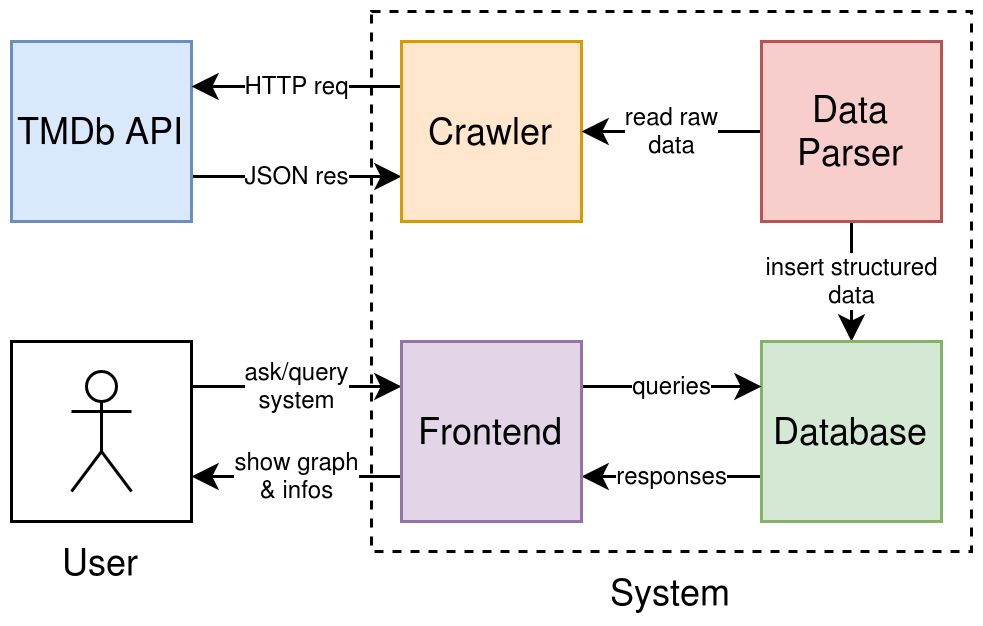

# Buts
Les buts de ce projet sont de déterminer les scores de films selon leur ratio revenu sur budget, de déterminer l'influence qu'ils ont sur les "peoples" (acteurs et membres de l'équipe de réalisation) qui ont participé aux-dits films et montrer les genres de films les plus populaires.

# Contexte et objectifs
Ce projet se déroule dans le cadre du cours de Web Mining du master MSE HES-SO. L'objectif principal du projet est de visualiser, sous forme graphe, les relations entre les films, leurs genres et les peoples. Nous appliquons des algorithmes choisis pour déterminer les noeuds du graphe les plus importants, trouver les plus courts chemins entre peoples et former des communautés de films, peoples ou genres.

# Données
Nous utilisons les données provenant de [The Movie Database (TMDb)](https://www.themoviedb.org/) à l'aide de son [API](https://developers.themoviedb.org/3/getting-started). À partir des données d'un film, nous avons tous les éléments nécessaires pour déterminer son score et ses relations aux peoples et genres associés. Ci-dessous un exemple de données retournées par l'API pour le film *Pirates of the Caribbean: The Curse of the Black Pearl* :

```json
{
    "budget": 140000000,
    "revenue": 655011224,
    "genres": [
        { "id": 12, "name": "Adventure" },...
    ],
    "id": 22,
    "title": "Pirates of the Caribbean: The Curse of the Black Pearl",
    "original_language": "en",
    "overview": "Jack Sparrow, a freewheeling ...",
    "release_date": "2003-07-09",
    "runtime": 143,
    "spoken_languages": [
        { "iso_639_1": "en", "name": "English"}
    ],
    "status": "Released",
    "popularity": 54.847,
    "vote_average": 7.7,
    "vote_count": 14020,
    "credits": {
        "cast": [
            {
                "cast_id": 12,
                "character": "Captain Jack Sparrow",
                "id": 85,
                "name": "Johnny Depp",
                "order": 0
            },
            {
                "cast_id": 5,
                "character": "Captain Hector Barbossa",
                "id": 118,
                "name": "Geoffrey Rush",
                "order": 1
            },...
        ],
        "crew": [
            {
                "department": "Directing",
                "id": 1704,
                "job": "Director",
                "name": "Gore Verbinski"
            },...
        ]
    },
    "keywords": {
        "keywords": [
            { "id": 911, "name": "exotic island" },
            { "id": 1318, "name": "blacksmith" },
            { "id": 1321, "name": "gold" },...
        ]
    },
    "similar": {
        "results": [
            {
                "id": 58,
                "title": "Pirates of the Caribbean: Dead Man's Chest",
                "release_date": "2006-06-20",
                "original_language": "en",
                "genre_ids": [ 28, 12, 14 ],
                "overview": "Captain Jack Sparrow works ...",
                "popularity": 31.344,
                "vote_count": 10605,
                "vote_average": 7.2
            },...
        ]
    }
}
```

Nous pouvons voir que nous avons les informations relatives au budget et revenu généré par le film, ainsi que l'ordre d'importance des acteurs ayant joué dedans et la liste des membres de l'équipe de réalisation, avec pour chacun la fonction endossée pour ce film. Nous avons également la liste des genres auxquels le film appartient, une liste de mots-clés concernant ce film et une liste de films similaires (basée sur les genres et mots-clés). Cette information peut être récupérée sur une URL de ce genre :

```bash
https://api.themoviedb.org/3/movie/$id?api_key=$key&language=en-US&append_to_response=credits%2Ckeywords%2Csimilar
```

La première étape est d'obtenir tous les films disponibles sur TMDb. Pour cela, l'API offre un export journalier de quelques informations basiques concernant les films, à savoir son id dans TMDb, son titre original, la popularité au sein du site et des indications si présence de vidéos et/ou contenu adulte, un exemple est visible ci-dessous. Le seul champs qui nous intéresse est l'id, qui nous permet de récuperer plus d'informations sur les films telles que présentées ci-dessus.

```json
{
    "adult": false,
    "id": 20,
    "original_title": "My Life Without Me",
    "popularity": 9.134,
    "video": false
}
{
    "adult": false,
    "id": 24,
    "original_title": "Kill Bill: Vol. 1",
    "popularity": 24.601,
    "video": false
}
{
    "adult": false,
    "id": 25,
    "original_title": "Jarhead",
    "popularity": 14.574,
    "video": false
}
```

Nous devons donc parcourir ce fichier, comportant plus de 500'000 films et récupérer les informations au format JSON.


# Architecture



Tout d'abord, un programme est dédié à la récupération de données proprement dites, à partir de l'API fournissant les données en JSON, enregistrant les données pour les films ayant les champs revenu et budget valides. Ensuite, ces données seront manipulées et insérées dans la base de donnée choisie de manière cohérente et selon les besoins de l'interface. Finalement, une interface graphique sera implémentée pour visualiser les graphes obtenus et exécuter des requêtes à la base de données.

## Uses cases
Voici la liste des principaux *uses cases* du système : 

- Visualiser l'interconnexion (via un graphe) entre les différentes entités représentées dans la base de données (films, acteurs, genres)
- Modifier l'affichage de ce graphe en spécifiant certains critères de recherche
- Visualiser (à l'aide du graphe) l'importance des films en fonction de leurs score (revenu/budget)
- Lister les différents films répertoriés dans notre base
- Rechercher films, *peoples* ou genres
- Visualiser les communautés d'acteurs, de genre ou de films qui ont des critères communs
- Visualiser le plus court chemin entre deux entités

# Technologies

Les langages et technologies envisagés sont Scala et/ou Rust pour la partie développement, pour la justesse, l'efficacité et/ou la performance, et OrientDB, ArangoDB ou Neo4j pour la base de données, avec leur propres langages de requêtes. Différents outils pour le frontend / visualisation sont également comparés.


## Bases de données

### OrientDB
OrientDB est une base de données écrite en Java, multi paradigme, stockant ses données sous forme de documents, pair clé-valeur ou graphe. Elle met en avant sa scalabilité horizontale, avec la possibilité de déployer une base OrientDB sur plusieurs machines. Elle utilise un langage de requête optimisé pour les requêtes dans un graphe, nommé Gremlin.

### ArangoDB
ArangoDB offre à peu près les mêmes fonctionnalités qu'OrientDB, c'est une base de données écrite en C++, multi paradigme, stockant ses données sous forme de documents, pair clé-valeur ou graphe. Elle met en avant des fonctionnalités comme un support pour données géographiques (GeoJSON) ou ArangoML, pipeline pour machine learning. Elle utilise un langage de requête optimisé pour les requêtes dans un graphe, nommé AQL.

### Neo4j
Noeo4j est une base de données écrite en Java/Scala stockant ses données sous forme de graphe, avec le contenu des données comme noeud ou sommet du graphe et les relations entre ces données comme arête ou arc du graphe. Elle utilise un langage de requête optimisé pour les requêtes dans un graphe, nommé Cypher.

### Bilan des bases de données
Après avoir comparé ces trois technologies, nous pensons utiliser Neo4j. Bien qu'elle soit moins scalable que les deux autres et apparemment moins performante sur des énormes jeux de données, elle offre nativement d'une part de nombreuses requêtes implémentant des algorithmes de centralité des noeuds de graphes, comme PageRank, ArticleRank ou de plus court chemin et d'autre part des méthodes de visualisation plus faciles à prendre en main. Étant donné le volume de données que nous allons traiter (sur les 500'000 films recensés sur TMDb, nous pensons qu'au moins quelques milliers ou dizaines de milliers ont les informations qui nous intéressent), les défauts apparents de Neo4j sont comblés par ces deux *killer features* qui comblent nos besoins.

## Frontend
TODO:


# Implémentation

## Features
Voici la liste des différentes fonctionnalités que nous allons réaliser dans le cadre de ce projet :

- Backend :

    - Récupération des données sur les films mises à disposition par TMDb
    - Traitement de ces données pour sélectionner uniquement ce dont nous avons besoin
    - Calcul d'un score pour les différents films
    - Insertion des données dans une base de données orientée graphe

- Frontend : 
  
    - Visualisation des données sous forme d'interface graphique représentant un graphe
    - Regroupement des données en fonction de certains critères (genre, film etc.)
    - Regroupement des acteurs en fonction des genres des films dans lesquels ils ont joué
    - Création de communautés
    - Recherche spécifique (film, acteur etc.)
    - Présentation des films en fonction de leurs scores respectifs


# Résultats attendus
Nous nous attendons à pouvoir comparer les scores des films entre eux, trouver des communautés d'acteurs/films/genres, ou de voir les genres de films les plus populaires.

## Test de validation du projet
En ce qui concerne la phase de test, nous avons prévu d'effectuer des tests unitaires au niveau des méthodes critiques et complexes, notament celles visant à interroger la base de données.
Pour la partie frontend, nous avons prévu d'effectuer une sorte d'audit, en faisant tester l'app à utilisateur externe au projet, afin d'avoir un retour sur l'expérience utilisateur de l'interface graphique proposée.
Une fois l'app développée, nous avons prévu une liste (ci-dessous) avec les principales fonctionnalités de notre application. Elles seront testées une à une, et, pour chaque fonctionnalité testée, une colonne correspondante sera renseignée si cette fonctionnalité a été validée ou non avec la possibilité de laisser un commentaire (3ème colonne).

Voir exemple ci-dessous :

| Feature   | Validation(OK/KO) | Comment           |
| --------- | ----------------- | ----------------- |
| Search    | OK                | Request are fast  |
| Zoom      | OK                | With the mouse    |
|           |                   |                   |

# Planning envisagé


| Étape                  | Délivrables / Workpackage                                                 |
|------------------------|---------------------------------------------------------------------------|
| Crawling des données   | Programme récupérant les données de TMDb et produisant des données brutes |
| Études des technos DB  | Choix final de la base de données                                         |
| Parsing + insertion DB | Base de données remplie avec des données cohérentes                       |
| Analyse algos graphes  | Choix final des algorithmes de graphes                                    |
| Frontend               | GUI disponible pour l'utilisateur final, avec les contrôles désirés       |
| Rapport                | Version définitive du rapport                                             |
